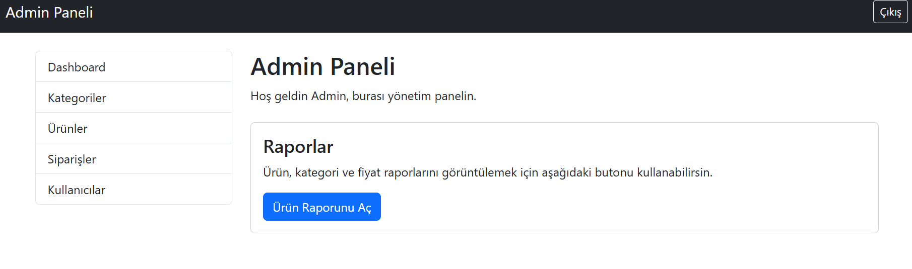
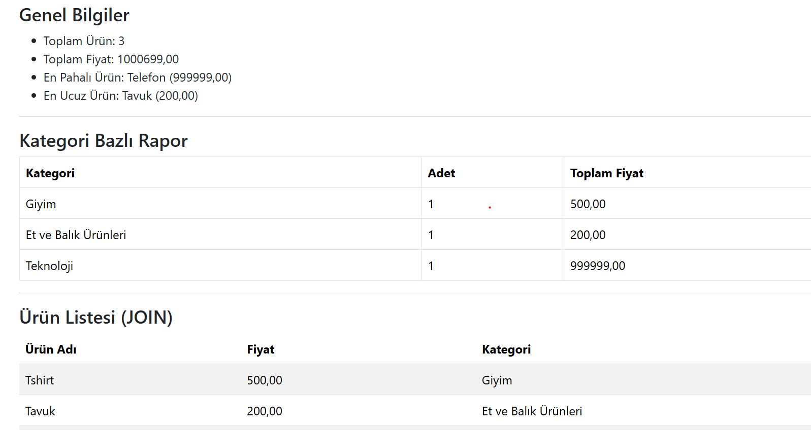
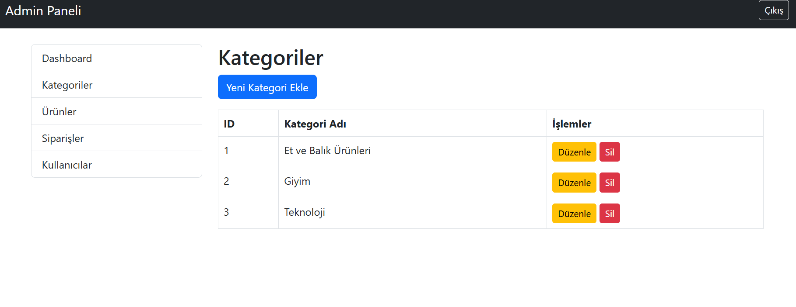
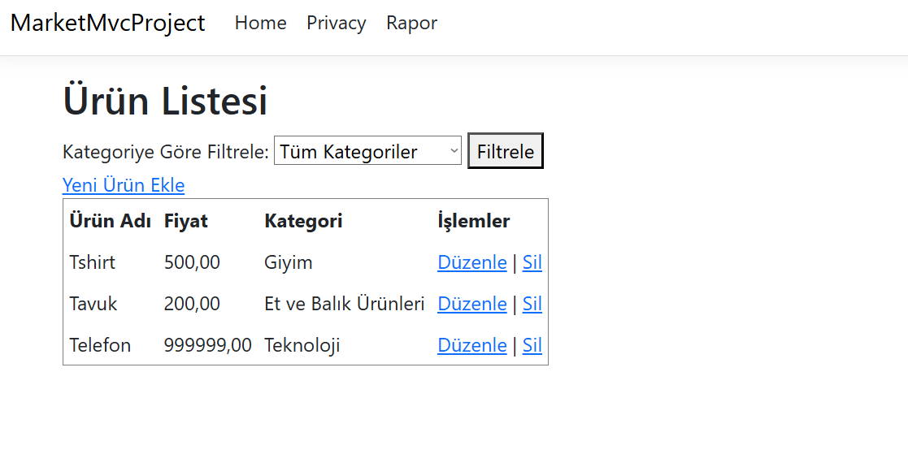
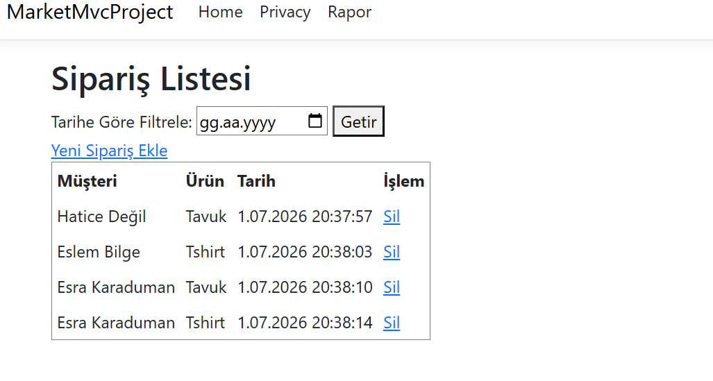

# Project 1: Market & Satış Yönetim Sistemi (MarketMvcProject)

Bu proje, ASP.NET Core MVC mimarisi kullanılarak geliştirilmiş kapsamlı bir **Market ve Satış Yönetim Sistemi**dir. Market içerisindeki ürünlerin, kategorilerin, siparişlerin ve müşteri bilgilerinin yönetimini kolaylaştırmak amacıyla tasarlanmıştır.

## 💻 Teknolojiler
* **Framework:** ASP.NET Core MVC (v8.0)
* **Veritabanı:** MS SQL Server & Entity Framework Core (Code-First)
* **Kimlik Doğrulama:** ASP.NET Core Session tabanlı oturum yönetimi
* **Arayüz Tasarımı:** HTML5, CSS3, Bootstrap, JavaScript

## 🚀 Özellikler
* **Yönetici Paneli (Admin):** Ürünlerin, kategorilerin ve siparişlerin genel yönetim paneli.
* **Ürün Yönetimi (UrunController):** Ürün ekleme, silme, güncelleme ve stok takibi.
* **Kategori Yönetimi (KategoriController):** Ürünleri gruplandırmak için dinamik kategori yönetimi.
* **Müşteri Yönetimi (MusteriController):** Müşteri bilgilerinin kaydı ve takibi.
* **Sipariş & Satış Yönetimi (SiparisController):** Yeni sipariş oluşturma, sepet işlemleri ve geçmiş siparişlerin listelenmesi.
* **Raporlama Paneli (RaporController):** Toplam satış tutarı, kritik stok seviyesindeki ürünler ve genel satış grafiklerinin raporlanması.
* **Kullanıcı Girişi (AccountController):** Yönetici ve kasiyer rolleri için güvenli giriş ekranı.

## 📸 Ekran Görüntüleri

### Ana Panel ve Ürün Listesi

  
  

  
🔍 Diğer Ekran Görüntülerini Göster

   
  

    
    
  

  

    
    
  

## 📂 Dosya Yapısı
* `Controllers/`: İş mantığının (Business Logic) yürütüldüğü kontrolcüler.
* `Models/`: Ürün, Kategori, Sipariş, Müşteri ve Rapor veri modelleri.
* `Views/`: Kullanıcıya gösterilen HTML (Razor syntax) arayüzleri.
* `Data/AppDbContext.cs`: Entity Framework Core veritabanı bağlantı sınıfı.

