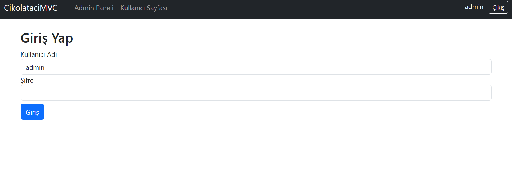
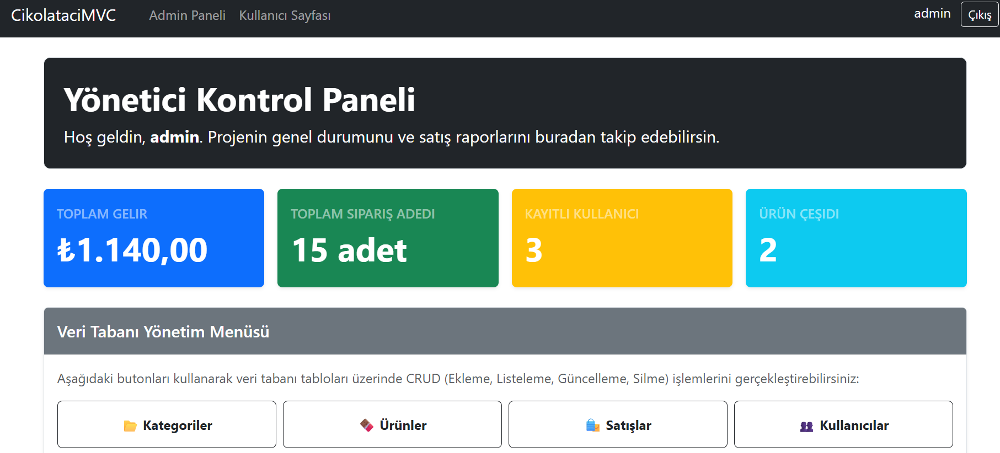
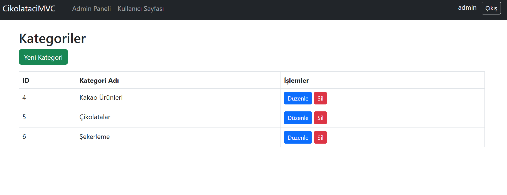
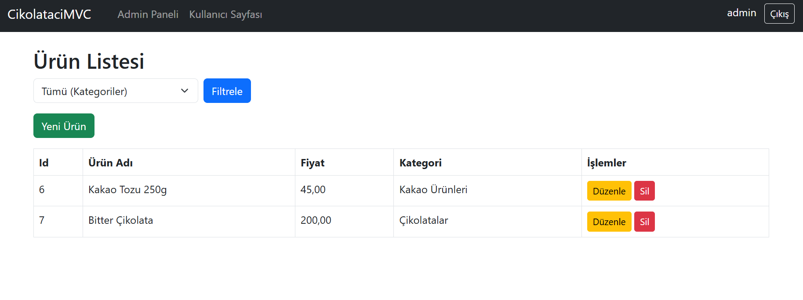
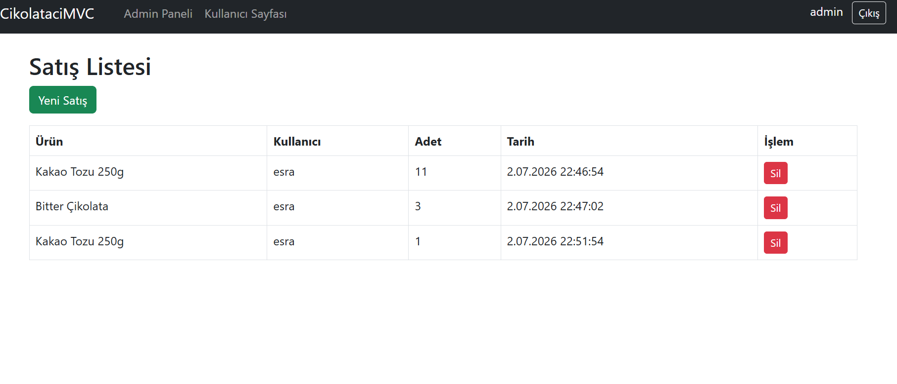
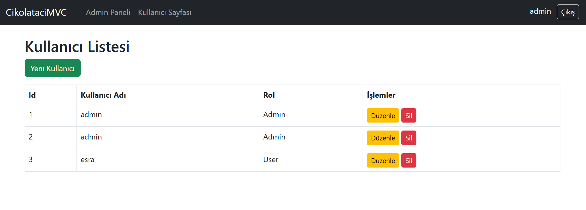

# Project 2: Butik Çikolatacı Satış ve Katalog Sistemi (CikolataciMVC)

Bu proje, bir butik çikolata mağazasının ürün kataloğunu sergilemesi, müşteri siparişlerini alması ve satış verilerini takip etmesi amacıyla geliştirilmiş **ASP.NET Core MVC** uygulamasıdır.

## 💻 Teknolojiler
* **Framework:** ASP.NET Core MVC (v8.0)
* **Veritabanı:** MS SQL Server & Entity Framework Core (Code-First)
* **Kimlik Doğrulama:** ASP.NET Core Identity / Cookie tabanlı üyelik yönetimi
* **Arayüz Tasarımı:** Bootstrap, Custom CSS3, Javascript, FontAwesome

## 🚀 Özellikler
* **Kategori Yönetimi (KategorilerController):** Bitter, sütlü, beyaz, dolgulu, spesiyal gibi çikolata kategorilerinin yönetimi.
* **Ürün Yönetimi (UrunlerController):** Fiyat, görsel, açıklama ve stok miktarı içeren ürün kartlarının eklenmesi ve güncellenmesi.
* **Müşteri & Üye Yönetimi (KullanicilarController / UserController):** Üyelik sistemi, profil düzenleme ve sipariş takibi.
* **Satış Yönetimi (SatislarController):** Yapılan satışların tarihi, adedi ve toplam tutarıyla kayıt altına alınması.
* **Yönetici Paneli (AdminController):** Mağaza yöneticisi için toplam gelir, en çok satan ürünler ve aktif sipariş durumlarının izlendiği kontrol paneli.
* **Giriş Sistemi (AccountController):** Güvenli kullanıcı kayıt, giriş ve çıkış işlemleri.

## 📸 Ekran Görüntüleri

### Vitrin ve Ürün Kataloğu
<p align="center">
  
  
</p>

<details>
  <summary>🔍 Diğer Ekran Görüntülerini Göster</summary>
  <br>
  <p align="center">
    
    
  </p>
  <p align="center">
    
    
  </p>
</details>

## 📂 Dosya Yapısı
* `Controllers/`: Çikolatacı iş mantığını yöneten kontrolörler.
* `Models/`: Çikolata, Kategori, Kullanıcı ve Satış veri yapıları.
* `Views/`: Müşteri arayüzü ve Admin yönetim ekranları.
* `Data/`: Entity Framework DbContext ve veritabanı şeması.


   ```
2. **Migration Uygulama:** Visual Studio Paket Yöneticisi Konsolu'nda aşağıdaki komutu çalıştırarak veritabanı tablolarını oluşturun:
   ```bash
   Update-Database
   ```
3. **Projeyi Çalıştırma:** Projeyi çalıştırıp butik çikolata dünyasını keşfetmeye başlayabilirsiniz.
