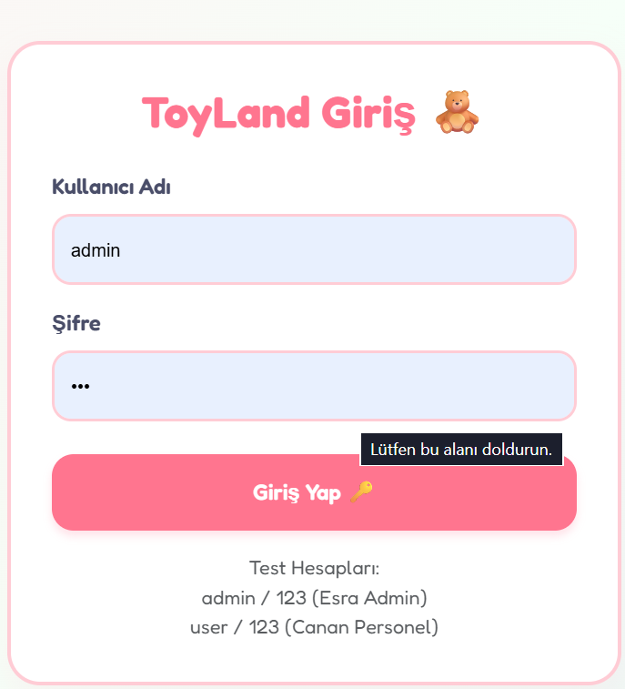
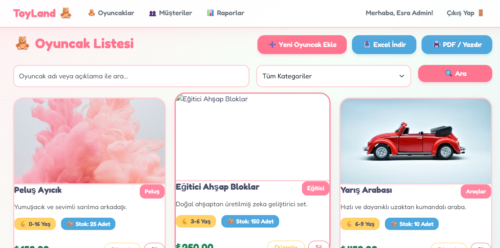
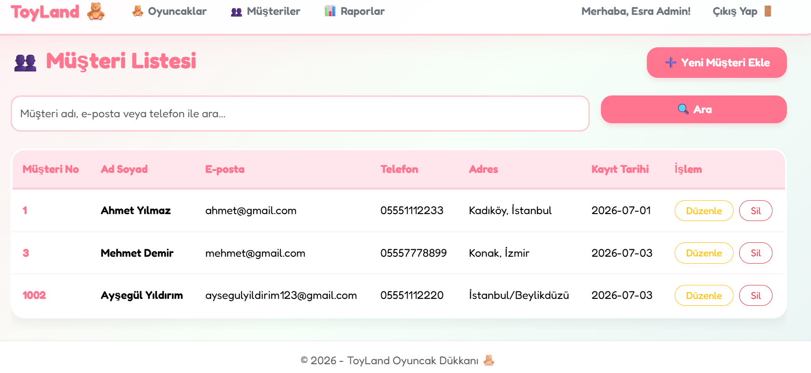
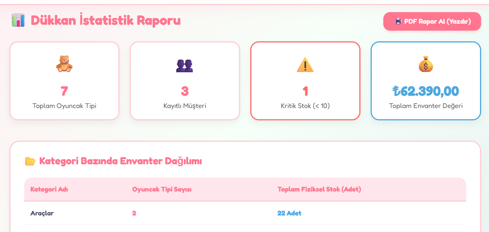
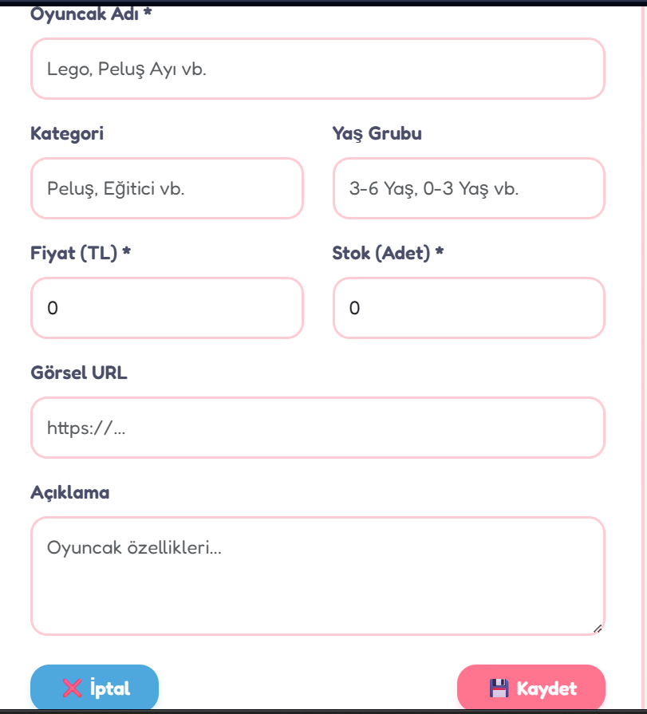

# Project 4: Oyuncak Dükkanı Razor Pages Portalı (Dukkanrzrpg)

Bu proje, ASP.NET Core MVC yerine **Razor Pages** teknolojisi kullanılarak geliştirilmiş, sayfa yönelimli (page-oriented) bir **Oyuncak Dükkanı Portalı**dır. Klasik denetleyici (Controller) yapısı yerine sayfa bazlı kod bloklarıyla (Code-Behind) geliştirilmiştir.

## 💻 Teknolojiler
* **Framework:** ASP.NET Core Razor Pages (v8.0)
* **Veritabanı:** MS SQL Server & EF Core (Code-First)
* **Arayüz:** HTML5, Razor Syntax, CSS3, Bootstrap, Javascript

## 🚀 Özellikler
* **Oyuncak Envanteri (Oyuncaklar/):** Eğitici, eğlenceli, ahşap vb. oyuncak kategorilerinin listelenmesi, oyuncak ekleme, detay görüntüleme, stok ve fiyat güncellemeleri.
* **Müşteri İlişkileri (Musteriler/):** Oyuncak alan müşterilerin kaydı, iletişim bilgileri ve alışveriş geçmişi takibi.
* **Satış Raporları (Rapor.cshtml):** En popüler oyuncak kategorileri, stokta azalan oyuncaklar ve aylık satış rakamlarının dinamik raporlanması.
* **Kullanıcı Girişi (Login.cshtml):** Dükkan sahibi ve çalışanları için oturum açma sayfası.

## 📸 Ekran Görüntüleri

### Oyuncak Kataloğu ve Müşteri Paneli

  
  

  
🔍 Diğer Ekran Görüntülerini Göster

   
  

    
    
  

  

    
    
  

## 📂 Dosya Yapısı (Razor Pages Özel)
* `Pages/Index.cshtml`: Dükkanın genel durumu ve hızlı istatistikler.
* `Pages/Oyuncaklar/`: Oyuncak yönetimiyle ilgili tüm `.cshtml` (arayüz) ve `.cshtml.cs` (kod) dosyaları.
* `Pages/Musteriler/`: Müşteri yönetimi sayfaları.
* `Pages/Rapor.cshtml`: Veri analizi ve raporlama ekranı.

