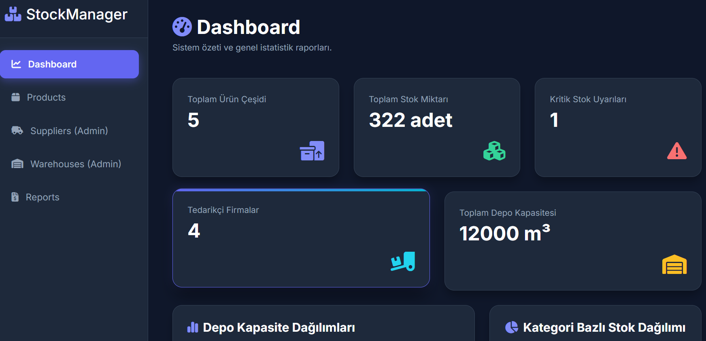
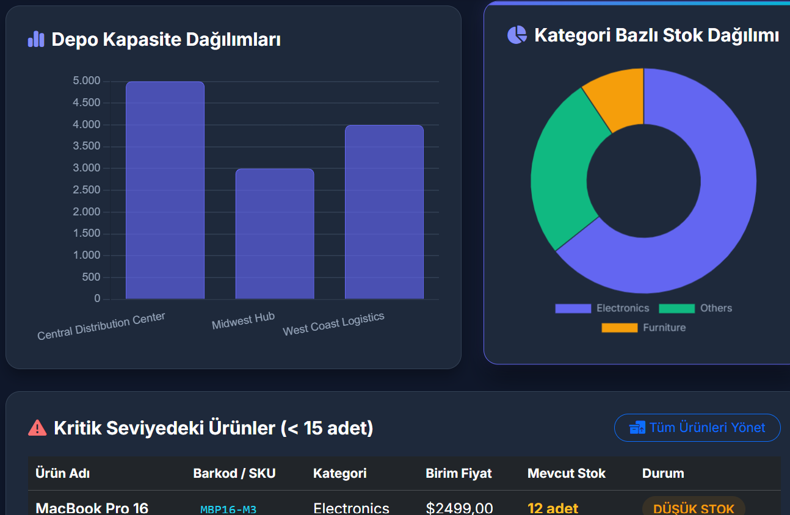
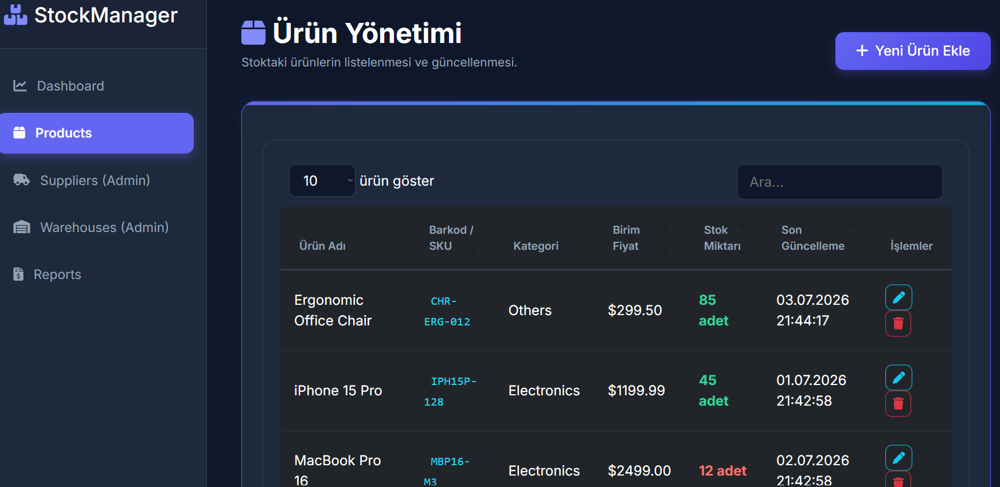
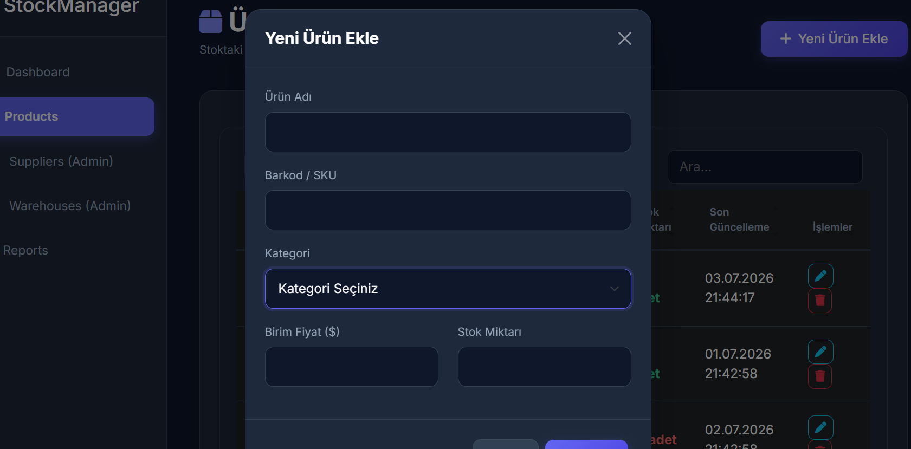
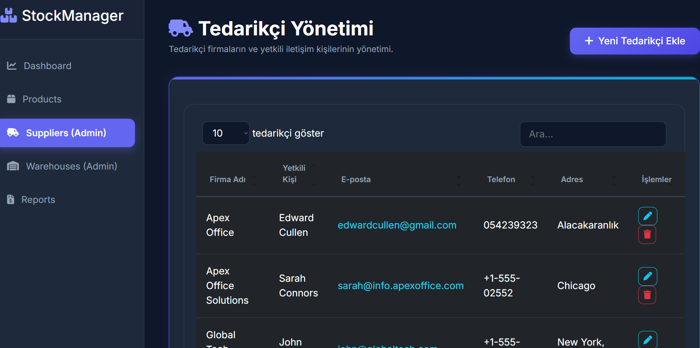
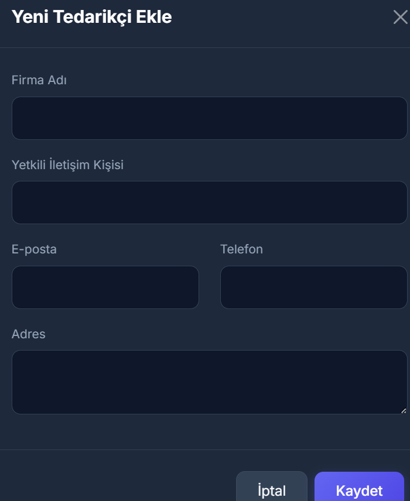
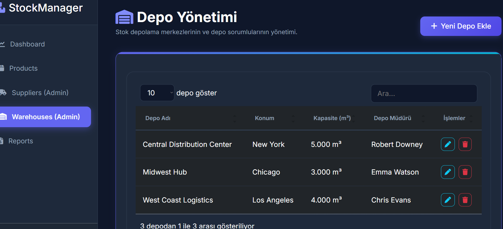
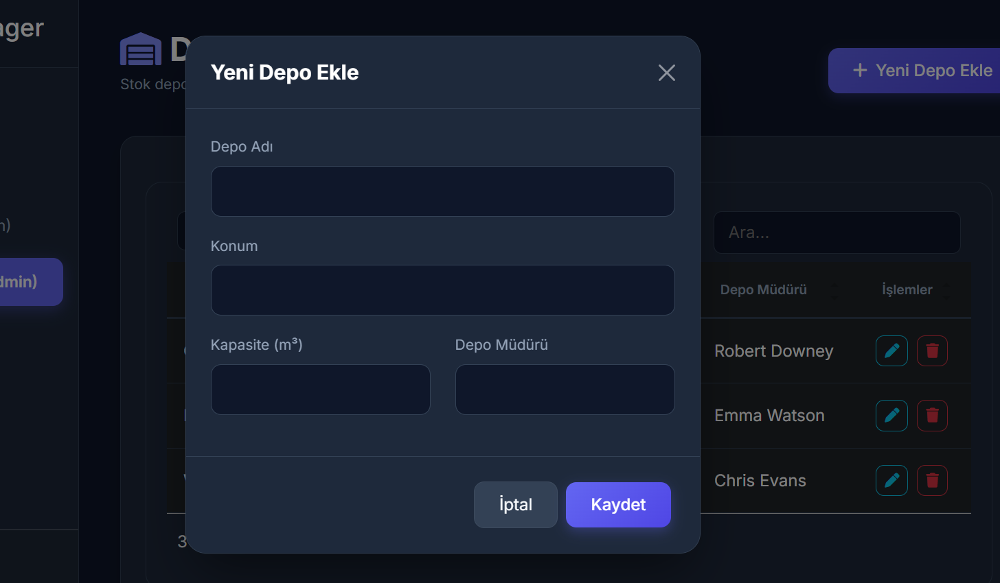
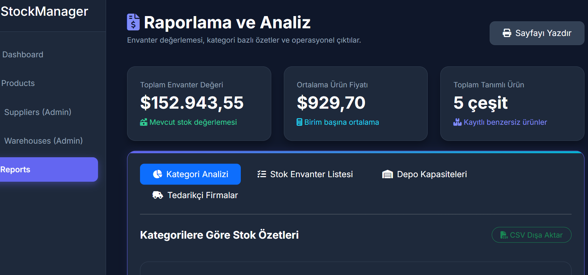
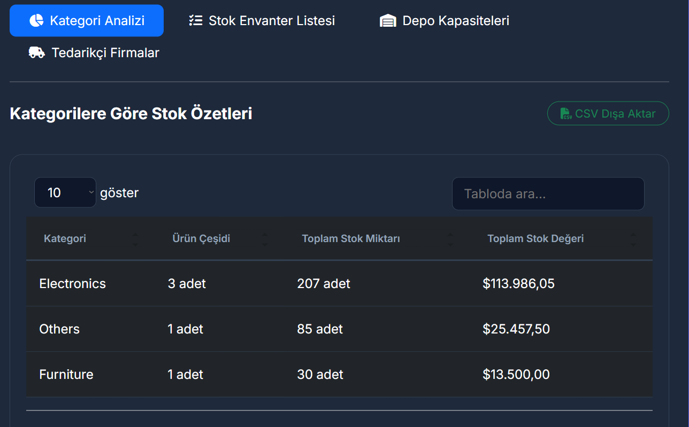

# Project 5: Depo & Stok Takip Sistemi (StockManager)

Bu proje, işletmelerin depolarındaki ürünleri, tedarikçileri ve depo içi ürün hareketlerini yönetmek amacıyla geliştirilmiş **ASP.NET Core MVC** tabanlı bir **Stok Takip Sistemi**dir.

## 💻 Teknolojiler
* **Framework:** ASP.NET Core MVC (v8.0)
* **Veritabanı:** MS SQL Server & Entity Framework Core (Code-First)
* **Tasarım:** HTML5, CSS3, Bootstrap, Javascript, Chart.js (Grafikler için)

## 🚀 Özellikler
* **Gösterge Paneli (DashboardController):** Toplam ürün adedi, aktif tedarikçi sayısı, kritik stok uyarıları ve depo doluluk oranlarının görselleştirildiği ana ekran.
* **Ürün Yönetimi (ProductController):** Ürünlerin barkod, kategori, fiyat ve mevcut stok bilgileriyle listelenmesi ve yönetilmesi.
* **Tedarikçi Yönetimi (SupplierController):** Ürün satın alınan firmaların veya kişilerin iletişim ve tedarik bilgileri.
* **Depo Yönetimi (WarehouseController):** Farklı fiziksel depoların/rafların tanımlanması ve ürünlerin depolara göre dağılımı.
* **Stok Raporları (ReportController):** Stok hareket günlükleri (giriş-çıkış işlemleri), en çok hareket gören ürünler ve stok maliyeti analizleri.
* **Kimlik Doğrulama (AccountController):** Güvenli oturum açma işlemleri.

## 📸 Ekran Görüntüleri

### Stok Kontrol Paneli ve Ürün Envanteri

  
  

  
🔍 Diğer Ekran Görüntülerini Göster

   
  

    
    
  

  

    
    
  

  

    
    
  

  

    
    
  

  

    
  

## 📂 Dosya Yapısı
* `Controllers/`: Stok, tedarik ve depo süreçlerini yöneten kontrolcüler.
* `Models/`: Product, Supplier, Warehouse, StockMovement ve User veri modelleri.
* `Views/`: Depo kontrol paneli, ürün listeleri ve tedarikçi formları.
* `Data/`: Entity Framework Context ve Migrations.

