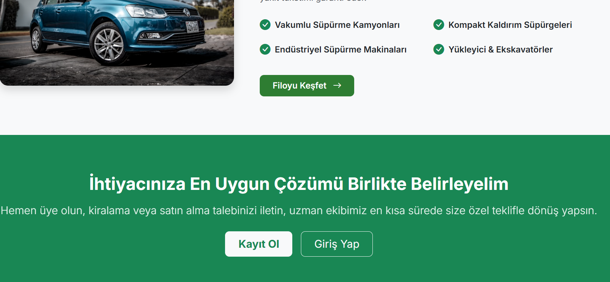
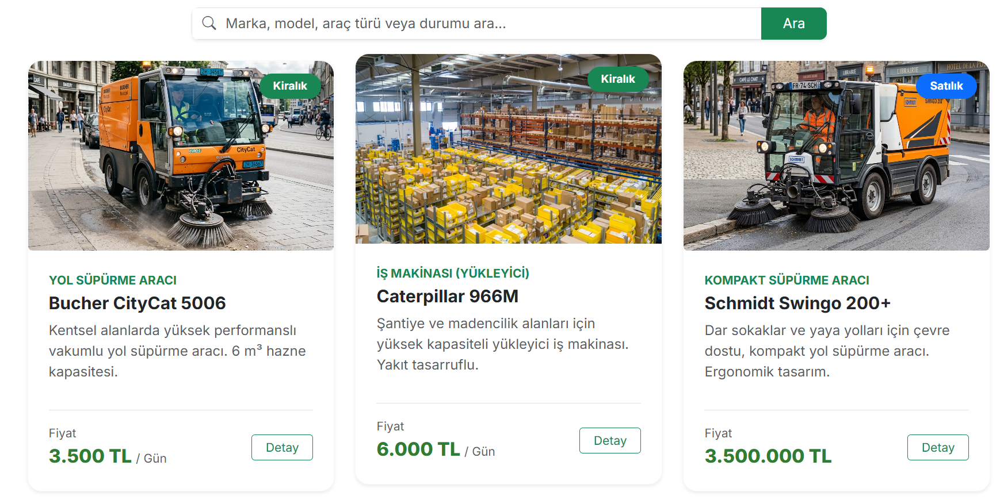
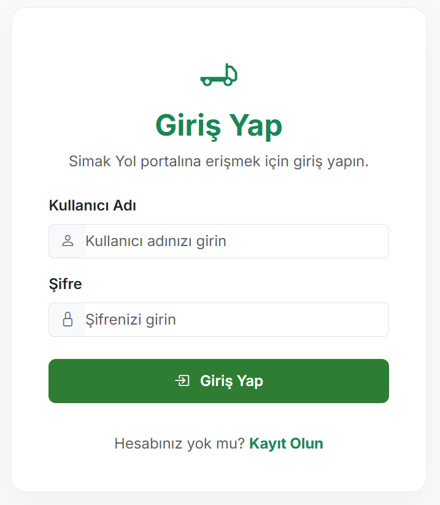
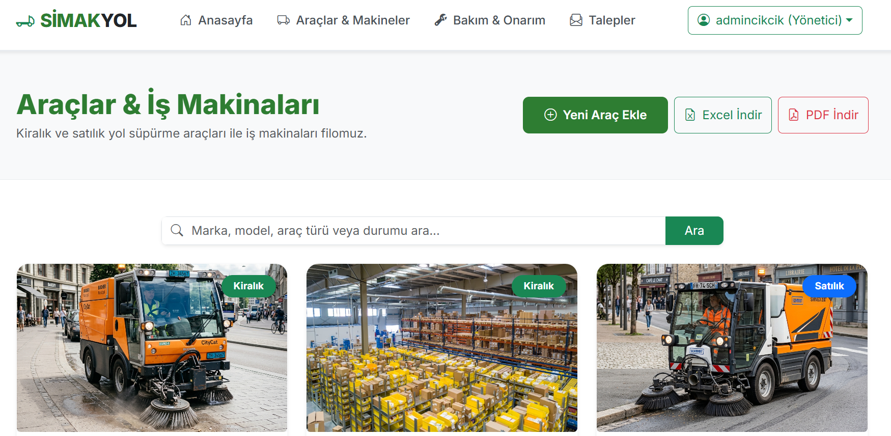
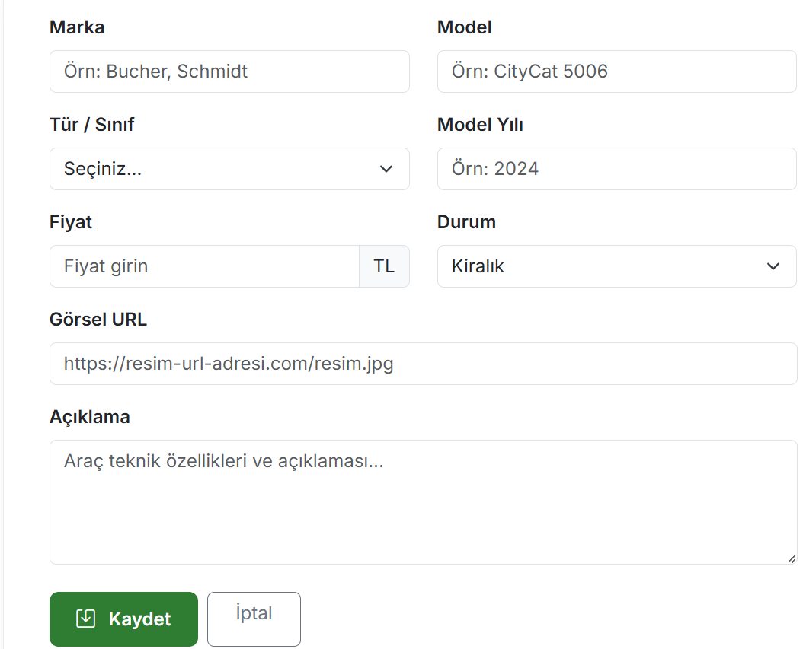
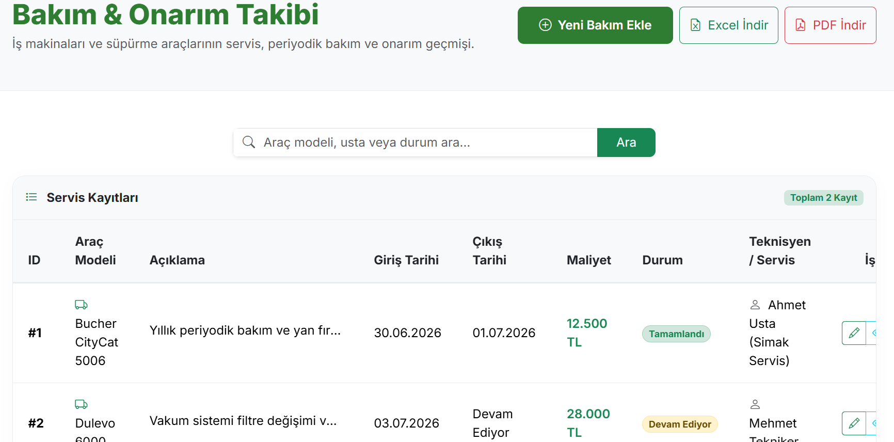
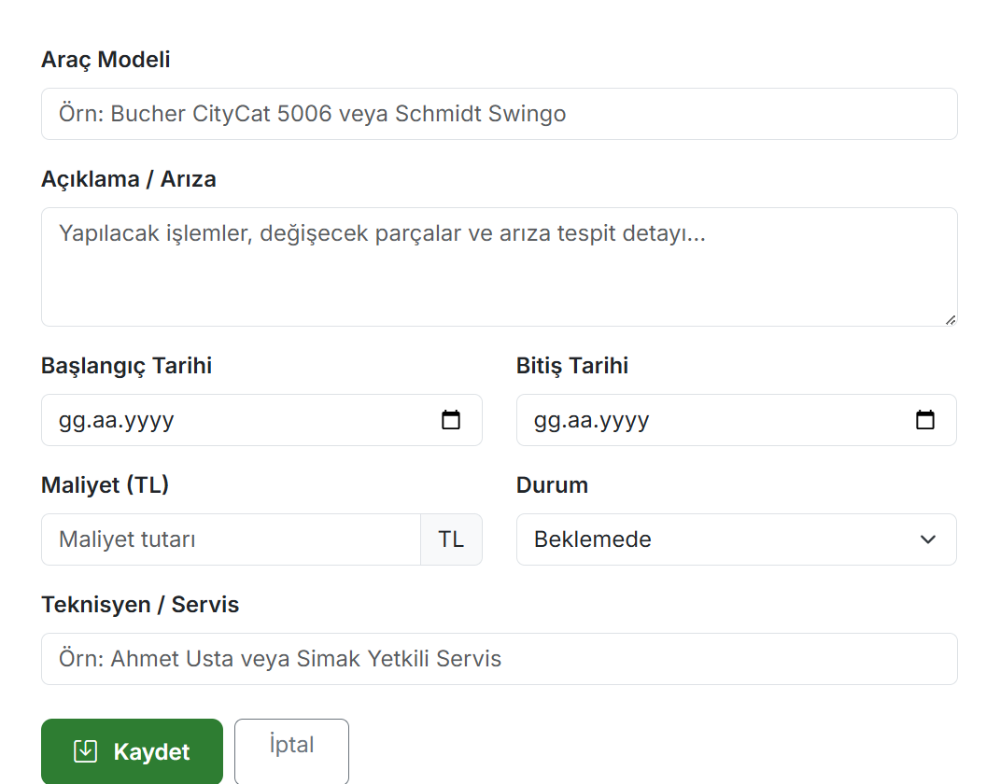
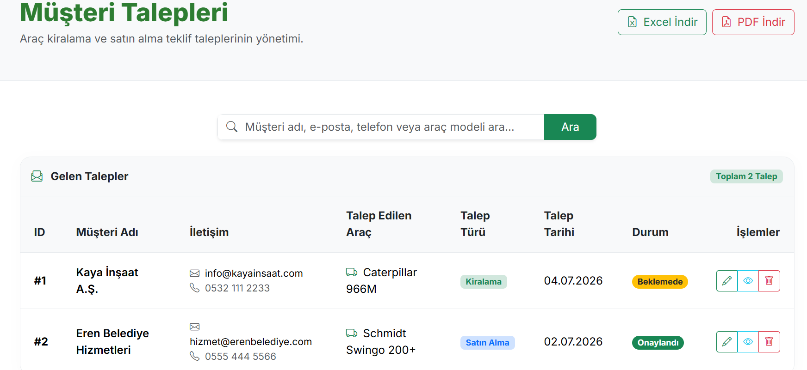

# Project 6: Simak Yol Süpürge Araç & Bakım Takip Sistemi (SimakYolSupurge)

Bu proje, yol süpürme araçlarının (filosunun), bu araçlara ait servis/arıza taleplerinin ve periyodik bakımlarının kayıt altında tutulması ve yönetilmesi amacıyla geliştirilmiş **ASP.NET Core MVC** uygulamasıdır. Veritabanı olarak hafif ve taşınabilir **SQLite** kullanılmıştır.

## 💻 Teknolojiler
* **Framework:** ASP.NET Core MVC (v8.0)
* **Veritabanı:** SQLite & Entity Framework Core (Database-First/Code-First uyumlu)
* **Kimlik Doğrulama:** ASP.NET Core Cookie Authentication & Rol Tabanlı Yetkilendirme (Admin, Tekniker, Sürücü)
* **Tasarım:** Bootstrap 5, FontAwesome, JavaScript

## 🚀 Özellikler
* **Araç Yönetimi (VehiclesController):** Süpürge araçlarının plaka, model, çalışma saati, yakıt türü ve mevcut durum (aktif/bakımda/arızalı) bilgilerinin takibi.
* **Bakım Yönetimi (MaintenancesController):** Araçlara uygulanan motor bakımı, fırça değişimi, hidrolik sistem kontrolleri gibi periyodik ve acil bakımların tarih, maliyet ve teknisyen bilgileriyle kaydı.
* **Arıza & Servis Talepleri (RequestsController):** Sürücüler tarafından oluşturulan arıza bildirimleri ve bunların teknisyenler tarafından onaylanıp bakıma dönüştürülmesi süreci.
* **Kullanıcı & Rol Yönetimi (AccountController):** Admin (tüm yetkiler), Tekniker (bakım girişleri) ve Sürücü (arıza bildirimleri) rolleriyle güvenli giriş.
* **API Desteği (Api/):** Dış sistemlerle entegrasyon veya mobil uygulamalar için temel veri çekme uç noktaları (Endpoints).

## 📸 Ekran Görüntüleri

### Araç Listesi ve Servis Talepleri

  
  

  
🔍 Diğer Ekran Görüntülerini Göster

   
  

    
    
  

  

    
    
  

  

    
    
  

  

    
  

## 🛠️ Kurulum ve Çalıştırma
1. **Veritabanı Dosyası:** Proje klasöründeki `SimakYolSupurge.db` adlı SQLite veritabanı dosyası hazır olarak gelmektedir. Herhangi bir harici veritabanı sunucusu kurulumuna ihtiyaç duymaz.
2. **Çalıştırma:** Visual Studio'da projeyi doğrudan başlatabilirsiniz.
3. **Varsayılan Oturum Bilgileri:** Proje veritabanında tanımlı kullanıcılar veya kayıt ekranı aracılığıyla yeni bir hesap oluşturarak sisteme giriş yapabilirsiniz.
