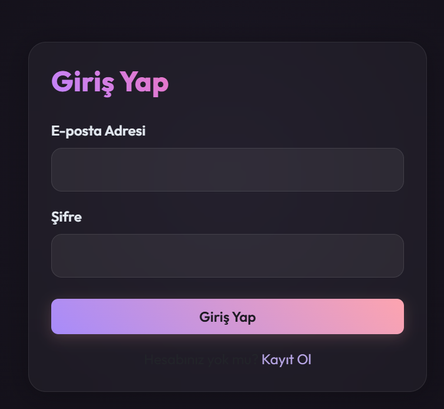
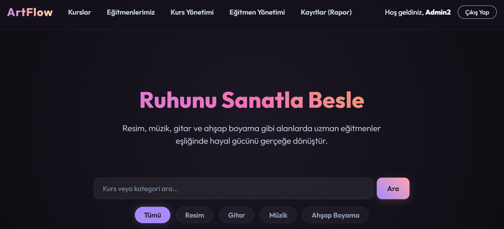
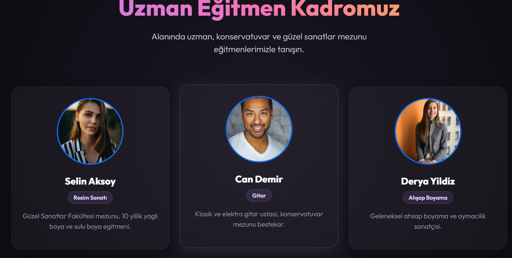
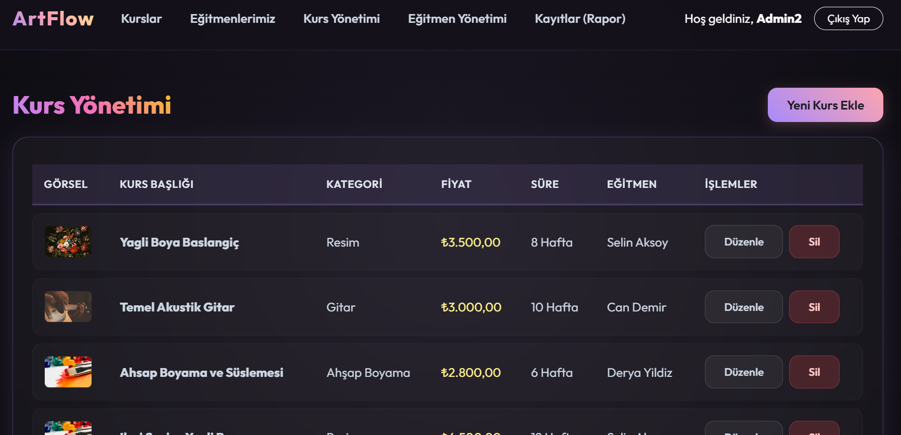
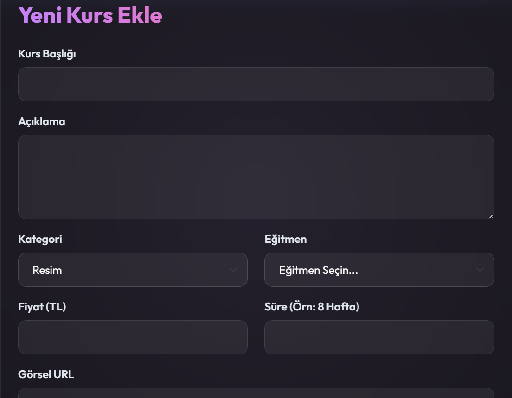
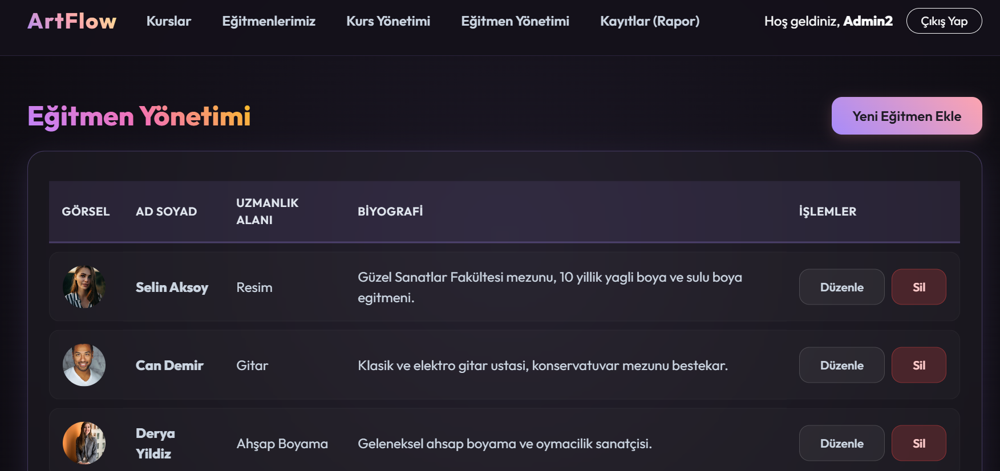
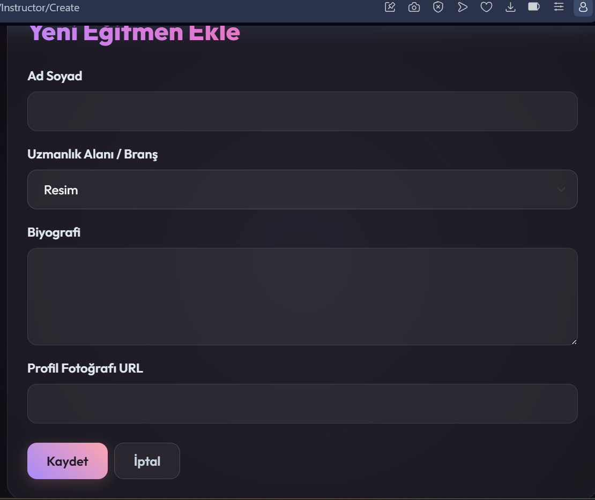
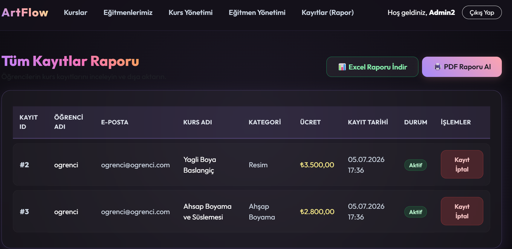
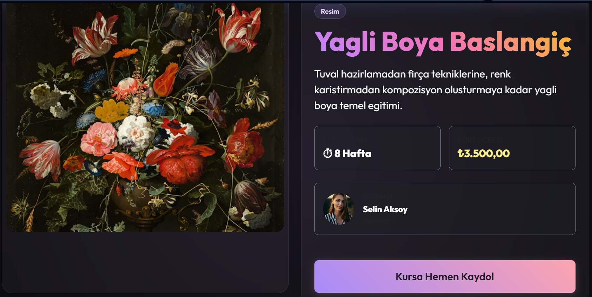
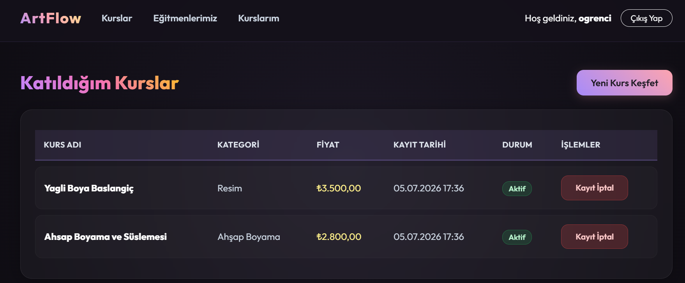

# Project 7: Kurs Kayıt & Öğrenci Yönetim Sistemi (Course Enrollment System)

Bu proje, eğitim kurumlarında veya kurs merkezlerinde kursların, öğrenci kayıtlarının, eğitmenlerin ve sınıf atamalarının dijital ortamda yönetilmesi amacıyla tasarlanmış **ASP.NET Core MVC** tabanlı bir otomasyondur.

## 💻 Teknolojiler
* **Framework:** ASP.NET Core MVC (v8.0)
* **Veritabanı:** MS SQL Server & Entity Framework Core (Code-First)
* **Veri Aktarımı:** EPPlus / ClosedXML (Excel dışa aktarma işlemleri için)
* **Kimlik Doğrulama:** ASP.NET Core Cookie tabanlı yetkilendirme (Rol Yönetimi ile)

## 🚀 Özellikler
* **Kurs Yönetimi (CourseController):** Kurs adı, kredisi, kapasitesi ve ders içeriği tanımlamaları.
* **Eğitmen Yönetimi (InstructorController):** Kursları veren öğretmenlerin uzmanlık alanları ve atandıkları derslerin yönetimi.
* **Kayıt Yönetimi (EnrollmentController):** Öğrencilerin kurslara kaydolması, devamsızlık ve not durumlarının takibi.
* **Veri Dışa Aktarma (ExportController):** Aktif kursların ve kayıtlı öğrencilerin listesini Excel veya PDF formatında dışa aktarma desteği.
* **Oturum Yönetimi (AccountController):** Admin ve Öğrenci rolleriyle sisteme güvenli giriş ve yetki kontrolleri.

## 📸 Ekran Görüntüleri

### Kurs Listesi ve Öğrenci İşlemleri

  
  

  
🔍 Diğer Ekran Görüntülerini Göster

   
  

    
    
  

  

    
    
  

  

    
    
  

  

    
    
  

  

    
    
  

## 📂 Dosya Yapısı
* `Controllers/`: Kurs, kayıt, eğitmen ve dışa aktarma operasyonlarını yöneten kontrolörler.
* `Models/`: Course, Student, Instructor, Enrollment ve Account modelleri.
* `Views/`: Öğrenci paneli, eğitmen yönetim formları ve kurs arama ekranları.
* `Data/`: Entity Framework DbContext sınıfı ve başlangıç verileri (Seed Data).

