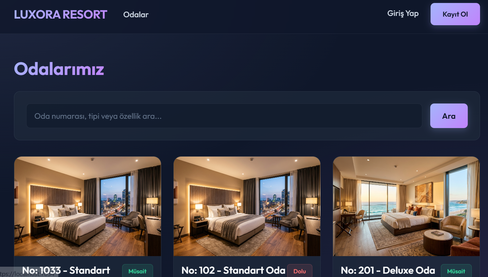
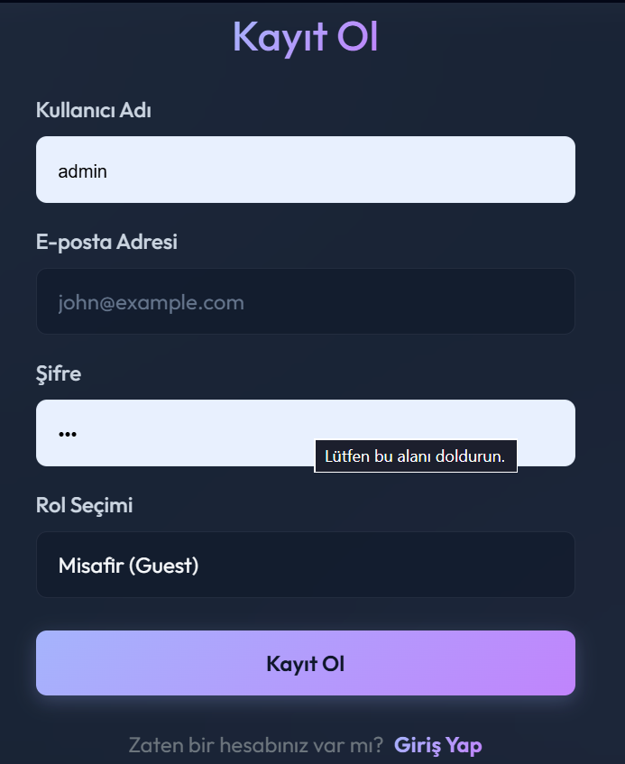
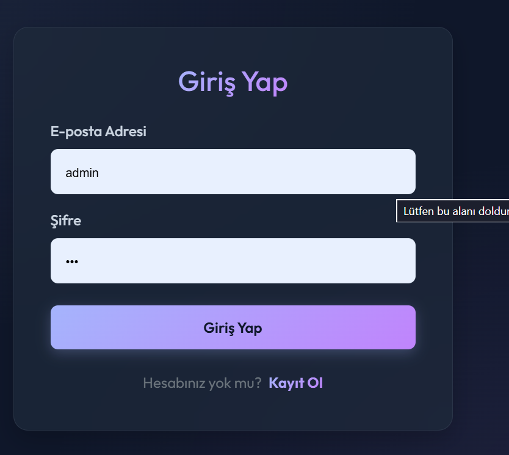
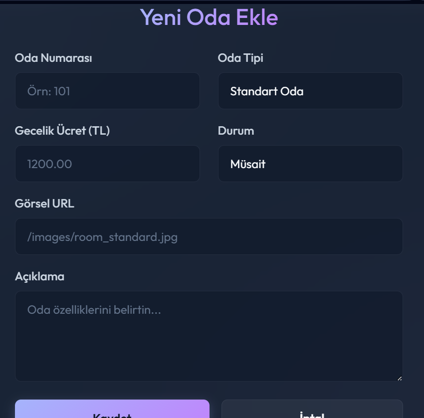
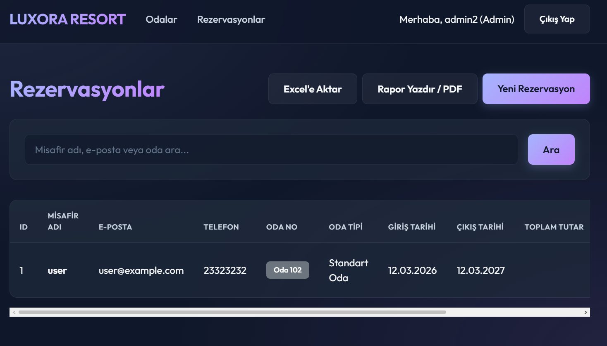
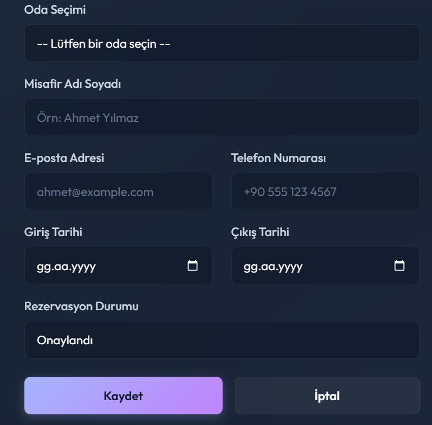
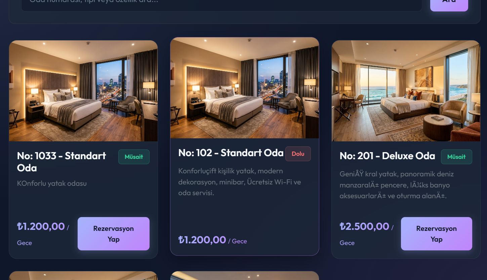

# Project 8: Otel Rezervasyon & Oda Yönetim Sistemi (HotelProject)

Bu proje, bir otelin oda kapasitesini, fiyatlandırmasını, müşteri rezervasyonlarını ve faturalandırma süreçlerini yönetmek amacıyla geliştirilmiş **Web API ve MVC** mimarisine sahip çift katmanlı bir projedir.

## 🧱 Proje Yapısı (Architecture)
1. **HotelProject.API:** Otel verilerini yöneten, JWT (JSON Web Token) tabanlı güvenli bir RESTful API servisidir. Rezervasyon ve oda CRUD operasyonlarını dış dünyaya sunar.
2. **HotelProject.MVC:** API servislerini tüketen (consuming), otel personeli ve müşterilerin kullandığı kullanıcı dostu web arayüzüdür.

## 💻 Teknolojiler
* **Backend:** ASP.NET Core Web API (v8.0)
* **Frontend:** ASP.NET Core MVC (v8.0)
* **Veritabanı:** MS SQL Server & Entity Framework Core (Code-First)
* **Kimlik Doğrulama:** JWT (JSON Web Token) & Cookie Authentication
* **Tasarım:** Bootstrap 5, Javascript (Ajax veri çekme işlemleri için), CSS3

## 🚀 Özellikler
* **Oda Yönetimi (RoomsController):** Oda numarası, oda tipi (Tek/Çift kişilik, Suit vb.), fiyatı, özellikleri (manzara, klima, TV vb.) ve doluluk durumu yönetimi.
* **Rezervasyon Yönetimi (BookingsController):** Giriş-çıkış tarihleri, konuk sayısı, toplam tutar hesaplaması ve aktif/geçmiş rezervasyonların listelenmesi.
* **API Yetkilendirme (AuthController):** JWT entegrasyonu ile güvenli API erişimi. Sadece yetkili MVC veya dış uygulamaların veri yazmasına izin verilir.
* **SQL Betikleri:** Veritabanının sıfırdan şemasını oluşturan `DbInit.sql` ve test verilerini dolduran `SeedDb.sql` dosyaları mevcuttur.

## 📸 Ekran Görüntüleri

### Oda Listesi ve Rezervasyon Yönetimi

  
  

  
🔍 Diğer Ekran Görüntülerini Göster

   
  

    
    
  

  

    
    
  

  

    
  

