# Project 9: Etkinlik & Bilet Rezervasyon Sistemi (TicketBooking)

Bu proje, sinema, tiyatro, konser ve festival gibi etkinlikler için bilet satış ve koltuk rezervasyonu işlemlerini yönetmek amacıyla geliştirilmiş, **Temiz Mimari (Clean Architecture)** prensiplerini temel alan **N-Tier (Çok Katmanlı)** bir web uygulamasıdır.

## 🧱 Temiz Mimari Yapısı (Architecture Layers)
1. **TicketBooking.Core (Domain & Entities):** Uygulamanın çekirdek iş modellerini (Event, Ticket, Category, User) ve veri erişim arayüzlerini (Repository Interfaces) barındıran, sıfır bağımlılığa sahip katman.
2. **TicketBooking.Data (Infrastructure/Data Access):** Entity Framework Core DbContext'i, veritabanı somut sınıflarını (Repositories) ve veritabanı göçlerini (Migrations) barındıran katman.
3. **TicketBooking.Service (Application/Business Logic):** Bilet alma, koltuk atama, etkinlik oluşturma gibi tüm iş kurallarının (Business Rules) koordine edildiği servis katmanı.
4. **TicketBooking.Web (Presentation/MVC):** Son kullanıcının ve yöneticilerin etkileşime girdiği, Razor sayfalarından ve kontrolörlerden oluşan web katmanı.

## 💻 Teknolojiler
* **Framework:** ASP.NET Core MVC (v8.0)
* **Mimari Standart:** Clean Architecture / N-Tier Architecture
* **Veritabanı:** MS SQL Server & Entity Framework Core
* **Oturum ve Yetki:** ASP.NET Core Identity & Rol Tabanlı Yetkilendirme (Admin, Müşteri)
* **Tasarım:** Bootstrap 5, Custom CSS3, JS, FontAwesome

## 🚀 Özellikler
* **Etkinlik Yönetimi (Admin / AdminController):** Konser, sinema veya tiyatro gibi etkinliklerin eklenmesi, tarih, yer, fiyat ve kapasite bilgilerinin güncellenmesi.
* **Bilet Satın Alma & Rezervasyon (TicketController):** Müşterilerin aktif etkinliklerden koltuk seçerek bilet rezerve etmesi, benzersiz koltuk numarası üretimi ve sepet işlemleri.
* **Kullanıcı Kayıt & Giriş (AccountController):** Müşteri kaydı, şifre sıfırlama, profil yönetimi ve admin paneline yetkisiz erişimlerin engellenmesi.
* **Gösterge Paneli:** Toplam satılan bilet sayısı, doluluk oranları ve etkinlik bazlı gelir raporları.

## 📸 Ekran Görüntüleri

### Etkinlik Seçimi ve Bilet Satın Alma
<p align="center">
  
  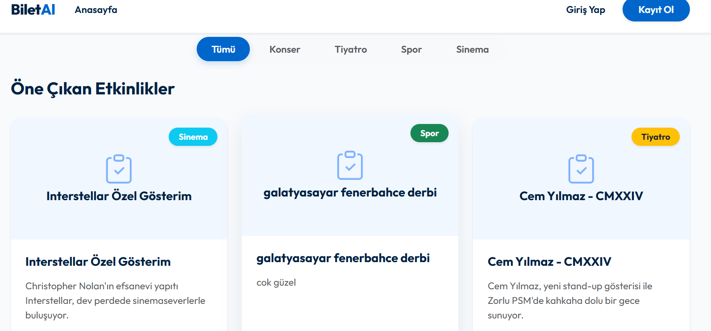
</p>

<details>
  <summary>🔍 Diğer Ekran Görüntülerini Göster</summary>
  <br>
  <p align="center">
    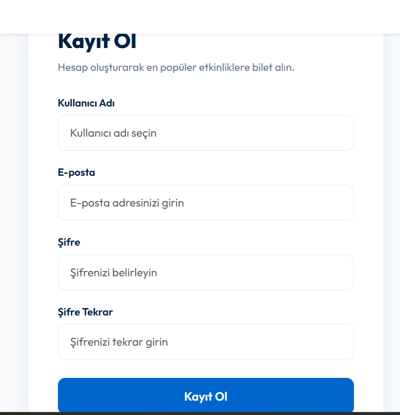
    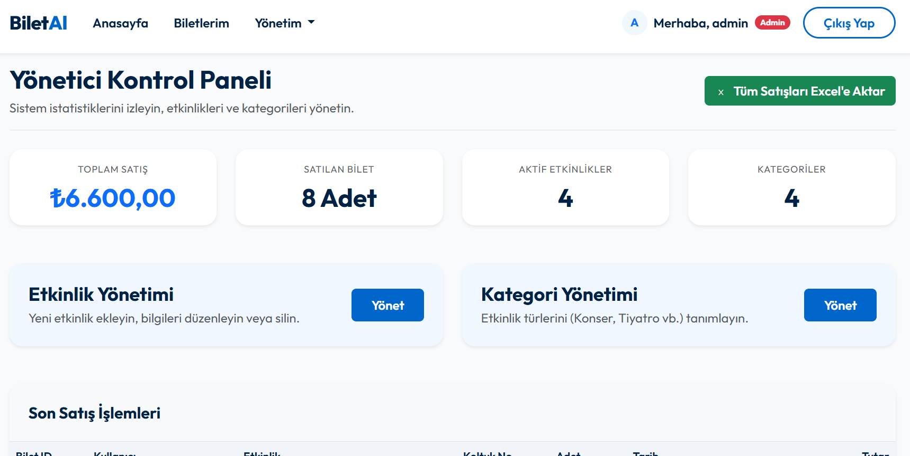
  </p>
  <p align="center">
    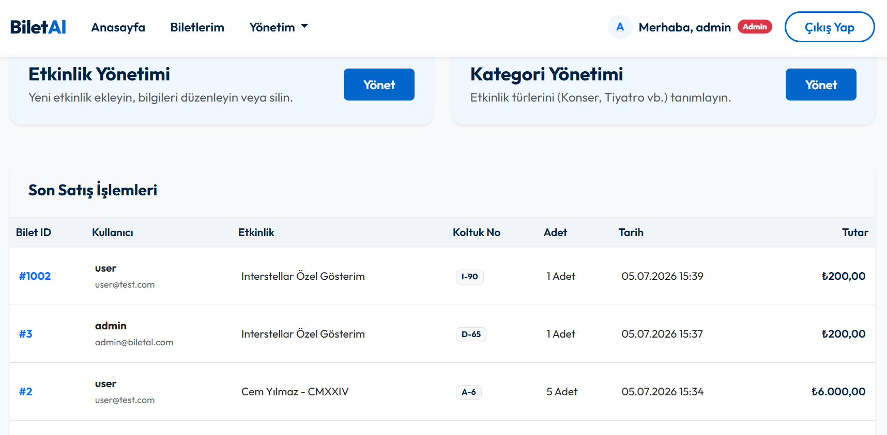
    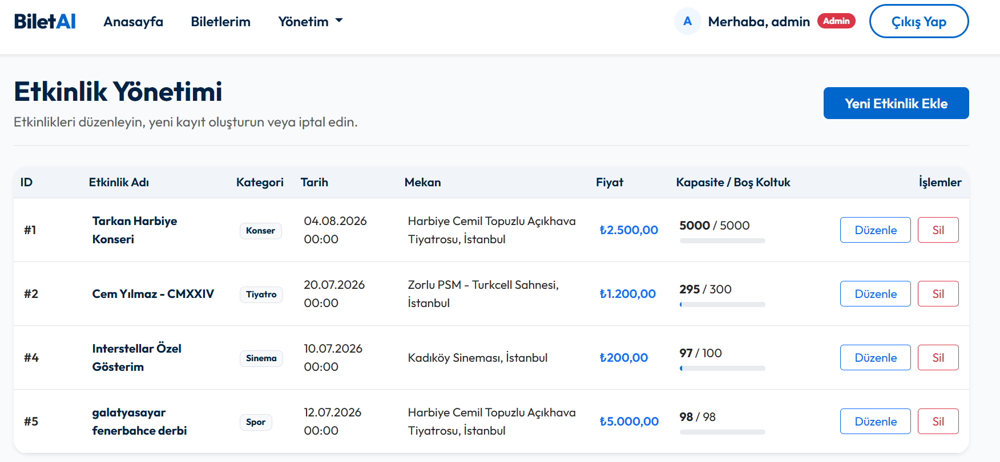
  </p>
  <p align="center">
    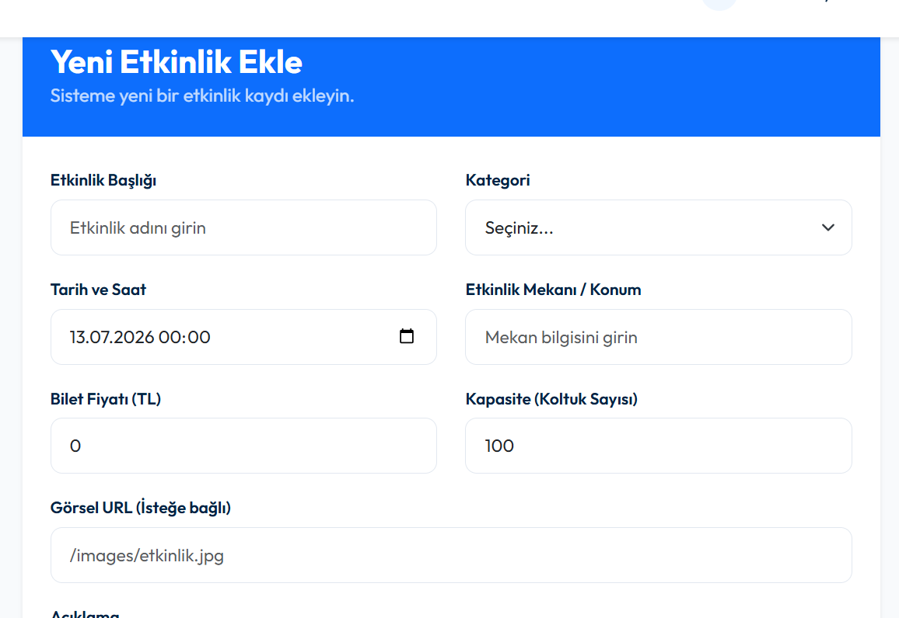
    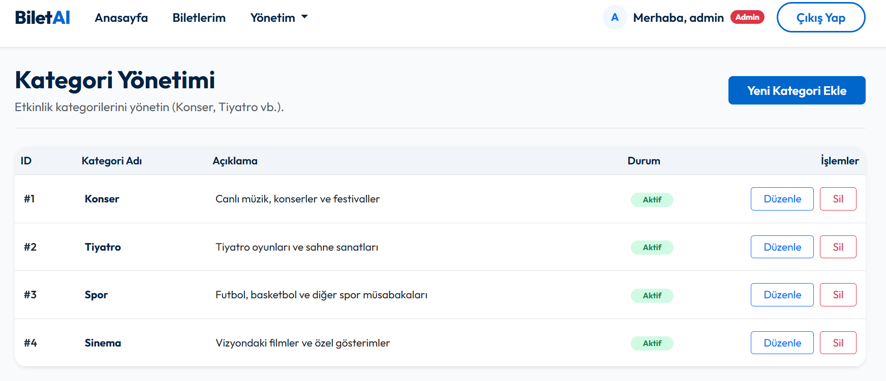
  </p>
  <p align="center">
    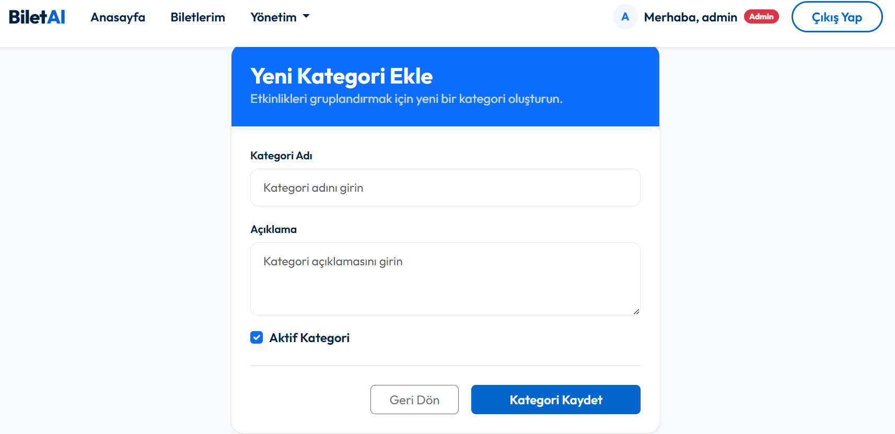
    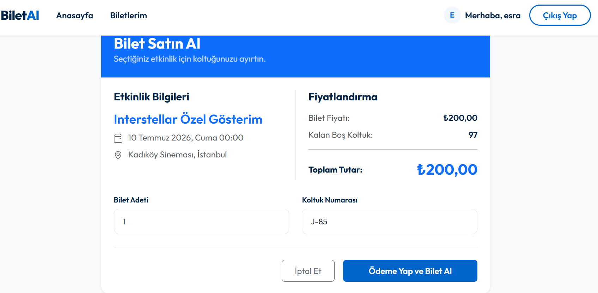
  </p>
  <p align="center">
    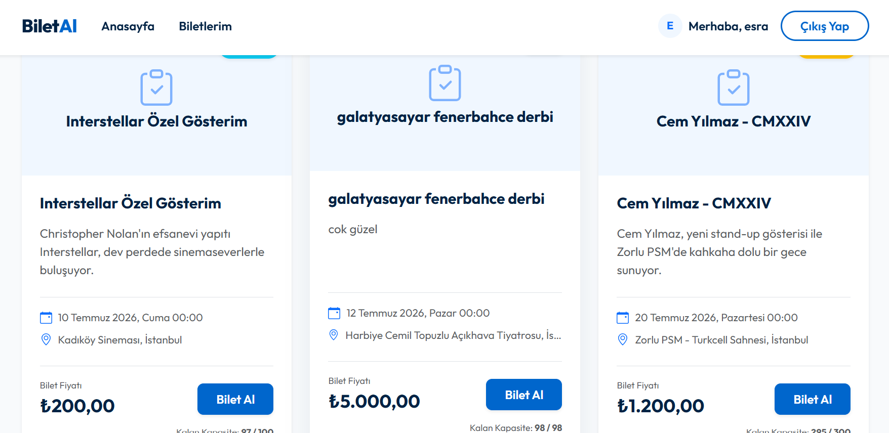
    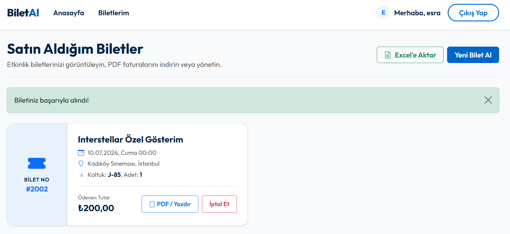
  </p>
</details>

## 🛠️ Kurulum ve Çalıştırma
1. **Veritabanı Ayarı:** `TicketBooking.Web` altındaki `appsettings.json` dosyasındaki SQL Server bağlantı dizesini düzenleyin.
2. **Migration:** Veritabanını oluşturmak için Package Manager Console'da varsayılan projeyi `TicketBooking.Data` olarak seçip şu komutu çalıştırın:
   ```bash
   Update-Database
   ```
3. **Çalıştırma:** `TicketBooking.Web` projesini başlangıç projesi olarak ayarlayıp çalıştırın.
