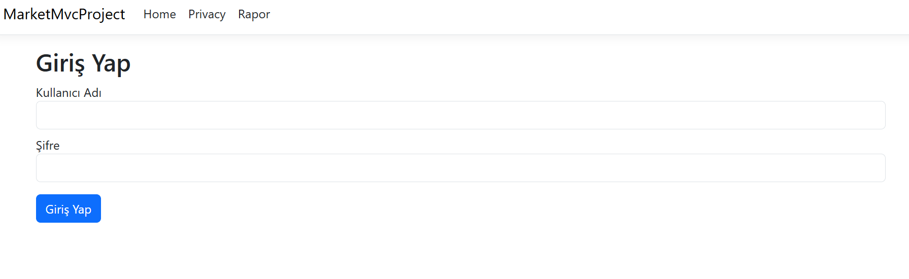
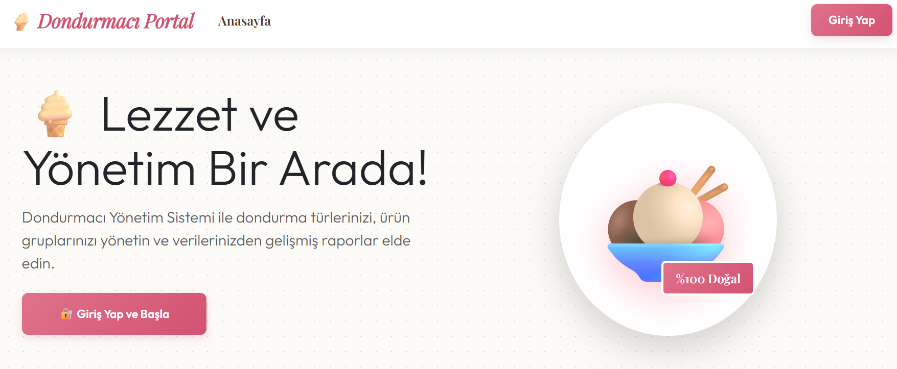
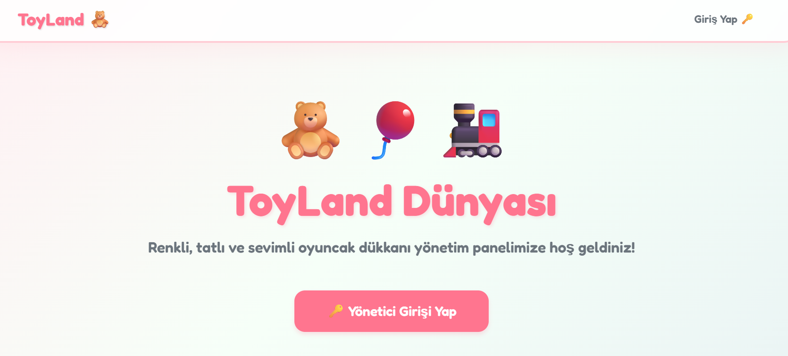
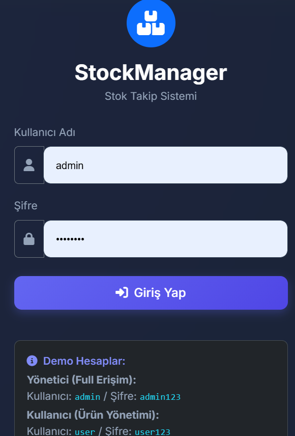
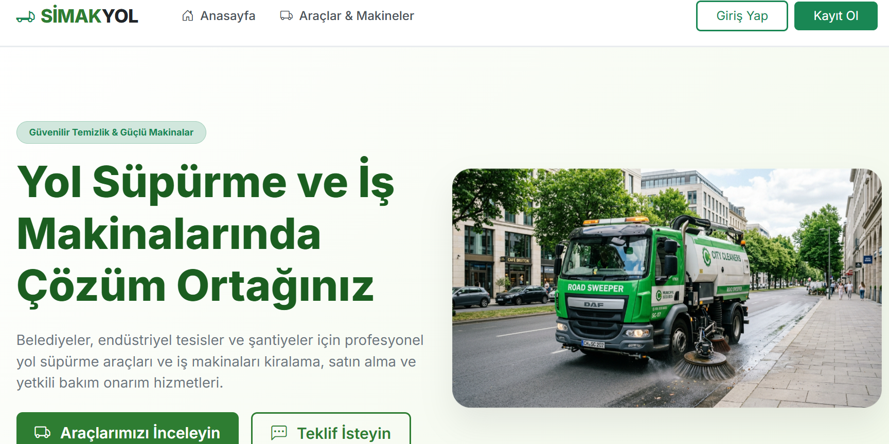
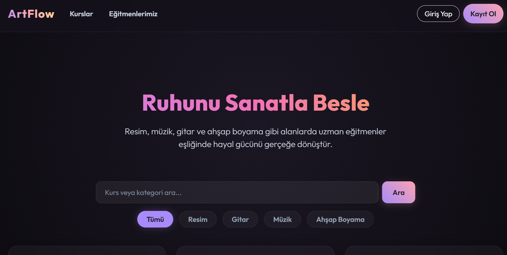
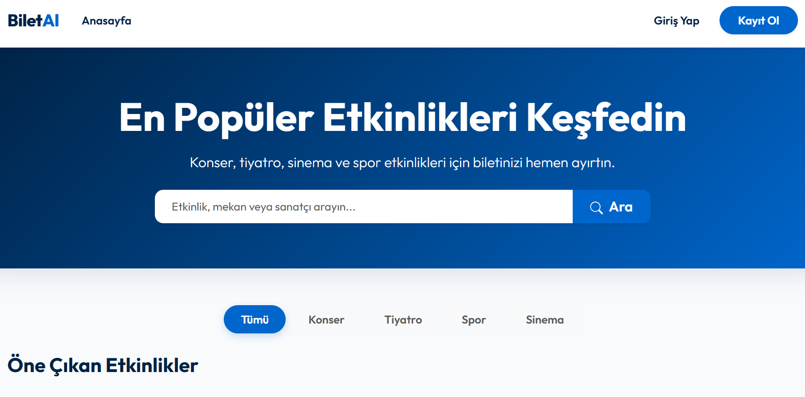

# 🚀 Softito C# / .NET Web Projeleri Portföyü

Bu depo, **Softito Akademi** bünyesinde C# ve .NET teknolojileriyle geliştirilmiş **9 farklı web ve otomasyon projesini** bir araya getiren kapsamlı bir portföydür. Projeler, basit MVC uygulamalarından katmanlı mimarilere (N-Tier) ve RESTful API entegrasyonlarına kadar geniş bir yelpazeyi kapsamaktadır.

---

## 📂 Proje Kataloğu

Aşağıda depodaki tüm projelerin özet bilgileri, kullanılan teknolojiler ve ekran görüntüleri yer almaktadır. Her projenin kendi klasöründe daha fazla ekran görüntüsü ve detaylı dokümantasyon bulunmaktadır.

### 1. Project 1: MarketMvcProject (Market & Satış Yönetimi)
* **Açıklama:** Ürün, kategori, müşteri ve sipariş yönetimini barındıran market otomasyonu.
* **Teknolojiler:** `ASP.NET Core MVC 8.0`, `EF Core`, `SQL Server`, `Session`
* **Klasör Linki:** [Project_1 Klasörüne Git](./Project_1)
* **Ekran Görüntüsü:**
  

    
  

---

### 2. Project 2: CikolataciMVC (Butik Çikolatacı Satış Portalı)
* **Açıklama:** Çikolata dükkanı için ürün sergileme, üye takibi ve sipariş yönetim portalı.
* **Teknolojiler:** `ASP.NET Core MVC 8.0`, `EF Core`, `SQL Server`, `Identity`
* **Klasör Linki:** [Project_2 Klasörüne Git](./Project_2)
* **Ekran Görüntüsü:**
  

    
  

---

### 3. Project 3: DondurmacfUI (Dondurma Dükkanı Stok & Satış)
* **Açıklama:** Ürün türleri ve satış raporları içeren katmanlı mimarili dondurma dükkanı paneli.
* **Teknolojiler:** `ASP.NET Core MVC`, `N-Tier Architecture`, `SQL Server`
* **Klasör Linki:** [Project_3 Klasörüne Git](./Project_3)
* **Ekran Görüntüsü:**
  

    
  

---

### 4. Project 4: Dukkanrzrpg (Oyuncak Dükkanı Razor Pages)
* **Açıklama:** Razor Pages mimarisiyle geliştirilmiş dinamik oyuncak dükkanı portalı.
* **Teknolojiler:** `ASP.NET Core Razor Pages`, `EF Core`, `SQL Server`
* **Klasör Linki:** [Project_4 Klasörüne Git](./Project_4)
* **Ekran Görüntüsü:**
  

    
  

---

### 5. Project 5: StockManager (Depo & Envanter Takip Sistemi)
* **Açıklama:** Depo doluluk oranları ve stok hareketlerini izleyen envanter takip paneli.
* **Teknolojiler:** `ASP.NET Core MVC`, `EF Core`, `SQL Server`, `Chart.js`
* **Klasör Linki:** [Project_5 Klasörüne Git](./Project_5)
* **Ekran Görüntüsü:**
  

    
  

---

### 6. Project 6: SimakYolSupurge (Araç Bakım & Servis Takip)
* **Açıklama:** SQLite veritabanlı, rol tabanlı yol süpürme araç bakım ve servis takip sistemi.
* **Teknolojiler:** `ASP.NET Core MVC`, `SQLite`, `Role Auth`, `Web API`
* **Klasör Linki:** [Project_6 Klasörüne Git](./Project_6)
* **Ekran Görüntüsü:**
  

    
  

---

### 7. Project 7: Course Enrollment (Kurs Kayıt & Öğrenci Yönetimi)
* **Açıklama:** Öğrenci kayıtları, dersler ve eğitmenleri yöneten kurs kayıt sistemi.
* **Teknolojiler:** `ASP.NET Core MVC`, `EF Core`, `SQL Server`, `Excel Export`
* **Klasör Linki:** [Project_7 Klasörüne Git](./Project_7)
* **Ekran Görüntüsü:**
  

    
  

---

### 8. Project 8: HotelProject (Otel Rezervasyon & Oda Yönetimi)
* **Açıklama:** JWT yetkilendirmeli Web API ve MVC arayüzlü otel rezervasyon sistemi.
* **Teknolojiler:** `Web API`, `ASP.NET Core MVC`, `JWT Auth`, `SQL Server`
* **Klasör Linki:** [Project_8 Klasörüne Git](./Project_8)
* **Ekran Görüntüsü:**
  

    
  

---

### 9. Project 9: TicketBooking (Etkinlik & Bilet Rezervasyon)
* **Açıklama:** Temiz Mimari (Clean Architecture) ile yazılmış etkinlik biletleme portalı.
* **Teknolojiler:** `Clean Architecture`, `ASP.NET Core MVC`, `EF Core`
* **Klasör Linki:** [Project_9 Klasörüne Git](./Project_9)
* **Ekran Görüntüsü:**
  

    
  

---

👨‍💻 **Geliştirici:** [Esra Karaduman](https://github.com/EsraKaraduman)  
🎓 **Eğitim Kurumu:** Softito Akademi
